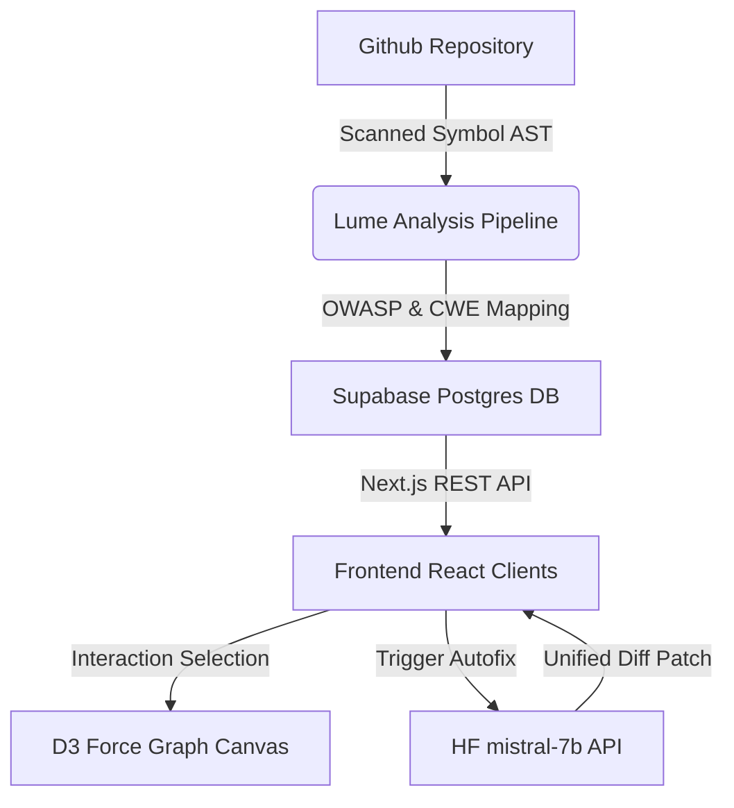

# 🛰️ DebtRadar (Lume)

> A premium, high-fidelity security, vulnerability, and technical debt analysis dashboard for modern engineering and security teams.

[](https://nextjs.org/)
[](https://tailwindcss.com/)
[](https://d3js.org/)
[](https://supabase.com/)

---

DebtRadar visualizes security risks, code-complexity propagation pathways, and software engineering technical debt. It maps scanned issues directly to standard industry security categories (OWASP Top 10, CWE definitions) and leverages HuggingFace Mistral LLM inference endpoints to generate non-technical summaries for executives and dynamic, click-to-deploy code patches (Autofixes).

## ✨ Features

### 1. 🌌 D3-Powered Codebase Galaxy (HeatMap)
* **Dynamic Simulation Canvas**: High-fidelity, force-directed network showing modules as nodes. Node size represents code blast radius and complexity.
* **Risk Heat Zones**: Color-gradient indicators dynamically display severity zones (Critical, High, Medium, Low).
* **Depth & Elevation**: Custom SVG drop-shadow filter layers render nodes with high contrast against the luxurious light sand-beige canvas.

### 2. 📊 Executive Metric Center
* **Unified Health Indicators**: High-contrast, bold-bordered dashboard elements highlighting repository health scores:
  * **Repo Security Score**: Comprehensive security health standing.
  * **Trust Score & Deployment Confidence**: Predicts production deployment stability and compliance index.
  * **Collapse Risk & Exploitability**: Highlights cascade failure risks and public exploit surfaces.

### 3. 🧠 Smart AI translation & AutoFix Pipeline
* **Business Translation Card**: Breaks down obscure codebase flaws into non-technical language (Customer Impact, Operational Risk, Action Required).
* **Automatic Code Autofixer**: Generate proposed remediation patches for vulnerable sections on-demand using mistral models, featuring live visual diff-patches (`git diff` representation) and click-to-approve code updates.
* **Intelligent Deduplication**: Automatically deduplicates similar backend-generated forecast insights for an clean, uncluttered user interface.

### 4. 🎨 Premium Warm Sand Aesthetic
* **Zero-White Design Philosophy**: Completely styled with a warm-neutral glassmorphism theme (`bg-[#f5efe7]` backdrops, solid sand `bg-[#efe8de]` card panels, cocoa-brown highlights).
* **Micro-Interactive Physics**: Includes elastic buttons (`active:scale-95`), float offsets (`hover:-translate-y-0.5`), and rotating map indicators on hover.

---

## 🛠️ Architecture & Tech Stack



* **Framework**: [Next.js 14](https://nextjs.org) (App Router, React Suspense, Dynamic Routing)
* **Data Visualization**: [D3.js](https://d3js.org) (Force Simulations, Interactive Canvas Zoom, Drag Vectors)
* **Styling**: [Tailwind CSS](https://tailwindcss.com) (Premium Warm-Neutral Glassmorphic Color Palette)
* **Database & Auth**: [Supabase Server Client](https://supabase.com) (Supabase Service Client serverless integrations)
* **LLM Engine**: [HuggingFace Inference API](https://huggingface.co) (Mistral-7B-Instruct / Zephyr-7B LLM orchestration)

---

## 🚀 Getting Started

### 📋 Prerequisites
* **Node.js** (v18.x or above)
* **npm / pnpm / yarn**
* **Supabase Account** & **HuggingFace API Key**

### ⚙️ Installation & Setup

1. **Clone the repository:**
   ```bash
   git clone https://github.com/your-username/Lume.git
   cd Lume
   ```

2. **Install all dependencies:**
   ```bash
   npm install
   # or
   pnpm install
   ```

3. **Configure Environment Variables:**
   Create a `.env.local` file in the root directory and add:
   ```env
   NEXT_PUBLIC_SUPABASE_URL=your-supabase-project-url
   NEXT_PUBLIC_SUPABASE_ANON_KEY=your-supabase-anon-key
   SUPABASE_SERVICE_ROLE_KEY=your-supabase-service-role-key
   HUGGINGFACE_API_KEY=your-hf-api-key
   GITHUB_PAT=your-github-personal-access-token
   ```

4. **Launch Local Dev Server:**
   ```bash
   npm run dev
   # or
   pnpm dev
   ```
   Open [http://localhost:3000](http://localhost:3000) to view the premium dashboard.

5. **Build for Production:**
   ```bash
   npm run build
   ```

---

## 🔒 License
Distributed under the MIT License. See `LICENSE` for more information.
