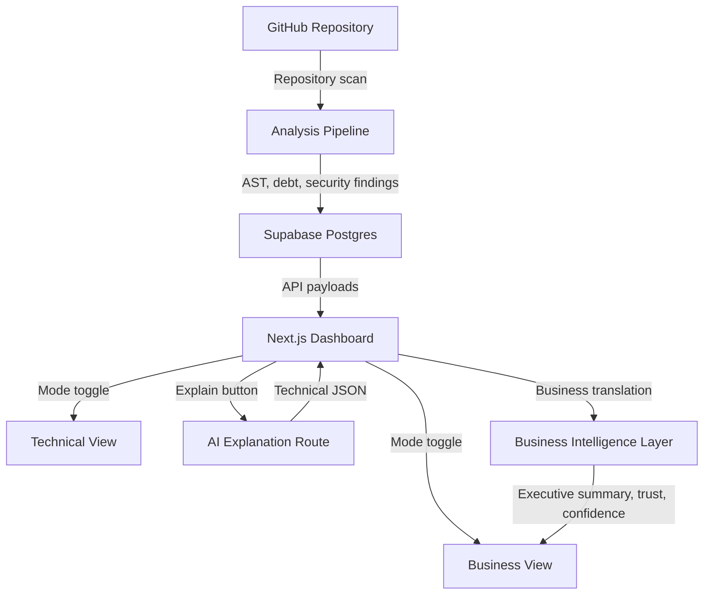

# 🛰️ DebtRadar (Lume)

> A premium software trust intelligence platform for security, technical debt, and AI-assisted code risk analysis.

[](https://nextjs.org/)
[](https://tailwindcss.com/)
[](https://d3js.org/)
[](https://supabase.com/)

---

DebtRadar scans repositories, maps technical debt and security findings to risk signals, and presents the results through two distinct experiences:

- Technical view for developers who need code-level detail, architecture context, and remediation guidance.
- Business view for non-technical stakeholders who need plain-language impact, trust scores, deployment confidence, and consequences if issues are ignored.

The platform combines static analysis, security categorization, graph visualization, deterministic business translation, and AI-assisted explanation.

## Highlights

### 1. Dual-view experience
The app has a global view mode toggle that changes what the user sees across the dashboard and node sidebar.

Technical view focuses on:
- Technical debt score
- Complexity and blast radius
- Security risk metrics
- Exploitability and propagation risk
- AI-generated technical explanation
- Autofix generation and remediation detail

Business view focuses on:
- Executive risk summary
- Trust score
- Deployment confidence
- Business impact translation
- Customer impact
- Operational risk
- Consequences if ignored
- Plain-language AI/business summaries

### 2. D3-powered repository graph
The HeatMap component renders the repository as a force-directed graph.

It shows:
- Nodes for functions, classes, modules, and variables
- Blast radius and debt-driven node sizing
- Security and risk-based coloring
- Node selection and sidebar detail views
- Interactive filtering by score, node type, OWASP/CWE, exploitability, and more

### 3. AI-assisted explanations
The selected node can be explained in two different ways depending on the active view:

- Technical view: a technical explanation generated through the Mistral-based AI path, focused on root cause, code impact, technical risk, and fixes.
- Business view: a business-focused summary built from deterministic business-intelligence helpers, focused on executive meaning, customer impact, operational risk, and urgency.

### 4. Business intelligence layer
The app includes a dedicated business translation layer that converts technical findings into decision-friendly language.

It powers:
- Executive risk summary cards
- Trust score and deployment confidence cards
- Business impact panels
- Consequence forecasting
- Business-mode roadmap and dashboard summaries

### 5. Autofix workflow
When a node supports it, the user can generate an autofix proposal.

The UI includes:
- Autofix availability indicators
- Autofix generation button
- Generated patch preview state
- Risk-aware remediation guidance

### 6. Premium warm UI
The dashboard uses a warm sand and cocoa visual language with glassmorphism panels, subtle gradients, and elevated cards.

It emphasizes:
- Strong contrast on light neutral backgrounds
- Rounded, tactile surfaces
- Hover lift and soft shadows
- Clear hierarchy for technical and executive content

## What Users See in Each View

### Technical view
The technical view is built for engineers and security reviewers.

Shown on the dashboard:
- Security overview
- Collapse prediction panel
- Attack propagation graph
- Node-level selected risk panel
- Autofix panel
- HeatMap graph
- Filter bar
- Fingerprint card
- Node sidebar with technical explanation

Shown in the node sidebar:
- Technical debt score
- Complexity
- Blast radius
- Duplication percentage
- Node type
- Security status
- Code scope
- Technical AI explain action
- Technical insights output

AI explanation content in technical view:
- Summary
- Root cause
- Technical risk
- Code-level impact
- Recommended fixes
- Priority level

### Business view
The business view is built for stakeholders who need the impact without the implementation detail.

Shown on the dashboard:
- Executive risk summary
- Trust score card
- Deployment confidence card
- Consequence forecast
- Business impact panel
- Security overview
- HeatMap graph
- Filter bar
- Node sidebar with business explanation

Shown in the node sidebar:
- Business explanation
- Consequence forecast
- Security status
- Code scope
- Business AI explain action
- Business insights output

Business view content includes:
- Executive summary
- Customer impact
- Operational risk
- Financial risk
- Recommended action
- What happens if ignored
- Likely consequence scenarios

## Architecture & Data Flow



## Core Features

- Repository scanning and analysis status tracking
- Technical debt scoring
- Security scoring and OWASP/CWE categorization
- Blast radius and propagation risk modeling
- Attack path and collapse risk visualization
- Business translation for executives and stakeholders
- Trust score and deployment confidence metrics
- AI explanation generation for selected nodes
- Autofix generation and remediation support
- Exportable analysis data
- Roadmap-style prioritization view

## Main Screens

### Analyze dashboard
The main analysis page combines:
- Repository summary header
- Security collapse banner
- Executive or technical cards depending on mode
- Security overview panels
- Attack propagation and collapse prediction
- Interactive graph and sidebar
- Filters, fingerprints, and autofix tools

### Roadmap view
The roadmap page prioritizes risk items and shows:
- Risk ranking
- Security and debt context
- Business impact indicators in business mode
- Trust and deployment confidence context
- Remediation priority guidance

### Auth callback
The callback route handles repository access and user session completion after authentication.

## Tech Stack

- Next.js 14 App Router
- React and TypeScript
- Tailwind CSS
- D3.js for graph visualization
- Supabase for persistence and auth
- Hugging Face inference for AI explanations
- PostgreSQL schema and migrations in Supabase

## Environment Variables

Create a `.env.local` file at the project root and provide:

```env
NEXT_PUBLIC_SUPABASE_URL=your-supabase-project-url
NEXT_PUBLIC_SUPABASE_ANON_KEY=your-supabase-anon-key
SUPABASE_SERVICE_ROLE_KEY=your-supabase-service-role-key
HUGGINGFACE_API_KEY=your-hf-api-key
GITHUB_PAT=your-github-personal-access-token
```

## Setup

### Prerequisites
- Node.js 18 or later
- pnpm, npm, or yarn
- Supabase project
- Hugging Face API key
- GitHub personal access token for repository access

### Install

```bash
git clone https://github.com/your-username/Lume.git
cd Lume
pnpm install
```

### Run locally

```bash
pnpm dev
```

Open http://localhost:3000 in your browser.

### Build

```bash
pnpm build
```

### Type check

```bash
pnpm exec tsc --noEmit
```

## Database

The Supabase schema lives in:
- [supabase/schema.sql](supabase/schema.sql)
- [supabase/migrations/20260523062107_updated_schema.sql](supabase/migrations/20260523062107_updated_schema.sql)

It stores:
- Repository analysis metadata
- Node-level technical debt and security metrics
- Business-facing risk data
- Explanation text
- Graph layout positions
- Security summaries and attack graph data

## Project Structure

- [app/](app/)
- [components/](components/)
- [lib/](lib/)
- [supabase/](supabase/)
- [types/](types/)

## Notes

- Technical and business modes intentionally show different content.
- The technical AI explanation is for engineering detail.
- The business view uses deterministic translation and forecasting so the insights stay stable and relevant.
- The UI is designed to help both developers and non-technical stakeholders make decisions from the same analysis.

## License

Distributed under the MIT License. See [LICENSE](LICENSE) for details.
